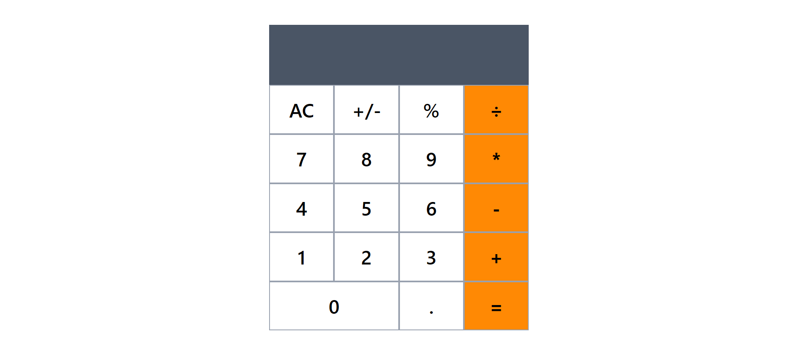

# Calculator App with React and TypeScript



## Overview

This is a simple calculator built with React, TypeScript, Vite, and Tailwind CSS. It supports the core arithmetic operations, decimal input, percentage, clear, and positive/negative toggle.

## Features

- Basic arithmetic: add, subtract, multiply, and divide
- Percentage calculation
- Positive/negative toggle
- Decimal input support
- Clear all and chained calculations

## Tech Stack

- React
- TypeScript
- Vite
- Tailwind CSS

## Getting Started

### Prerequisites

- Node.js
- npm

### Install

```bash
npm install
```

### Run the app in development

```bash
npm run dev
```

Then open the local URL shown in the terminal.

### Build for production

```bash
npm run build
```


## Project Structure

```text
src/
	App.tsx
	main.tsx
	index.css
	components/
		Buttons.tsx
		Interface.ts
```
